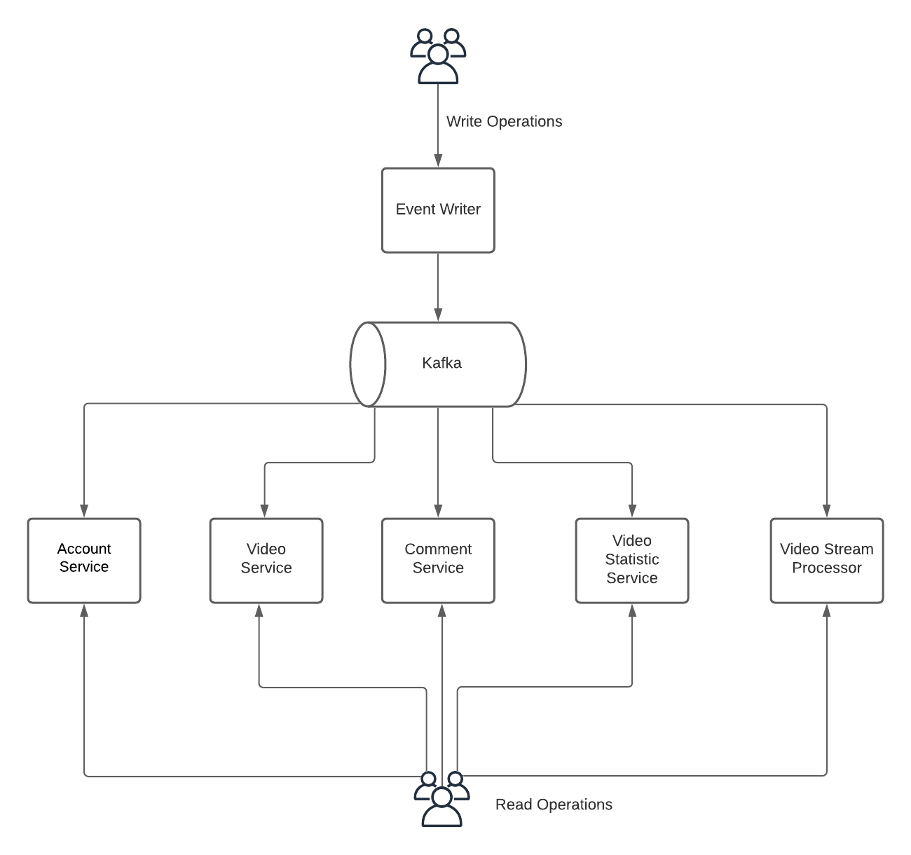

# Eventsourced video service

Eventsourced video service is a proof-of-concept showcasing a
central unified log approach. 

## High Level Architecture


From the diagram you can see that this architecture covers two
patterns: [CQRS](https://martinfowler.com/bliki/CQRS.html) and [Event Sourcing](https://martinfowler.com/eaaDev/EventSourcing.html).

#### EventWriter 
EventWriter service is an entry point for all write operations. 
Its responsibility is validating of incoming requests and routing them to appropriate Kafka topics.
The list of write operations:
- Register Video 
`POST http://localhost:8081/videos/register`
```json
{
    "accountId": "abd221c0-203d-11eb-adc1-0242ac120002",
    "title": "The Lord of the Rings Trailer Official",
    "imageUrl": "https://video-service-image-bucket.s3-eu-west-1.amazonaws.com/LOR.jpg",
    "videoUrl": "https://video-service-video-bucket.s3-eu-west-1.amazonaws.com/LOR.mp4"
}
``` 
- Comment Video
`POST http://localhost:8081/comments/comment`
```json
{
    "videoId": "b5267fad-fa29-4ea3-9e22-7adc733af475",
    "accountId": "abd221c0-203d-11eb-adc1-0242ac120002",
    "comment": "What is going on here?"
}
``` 
- Rate Video
`POST http://localhost:8081/videos/rate`
```json
{
    "videoId": "b5267fad-fa29-4ea3-9e22-7adc733af475",
    "accountId": "abd221c0-203d-11eb-adc1-0242ac120002",
    "rating": 4
}
``` 
- View Video
`POST http://localhost:8081/videos/view`
```json
{
    "videoId": "b5267fad-fa29-4ea3-9e22-7adc733af475",
    "accountId": "abd221c0-203d-11eb-adc1-0242ac120002"
}
``` 
- Register Account
`POST http://localhost:8081/accounts/register`
```json
{
    "accountId": "abd221c0-203d-11eb-adc1-0242ac120002",
    "name": "Alex",
    "description": "Video channel"
}
``` 
- Subscribe To Account
`POST http://localhost:8081/accounts/subscribe`
```json
{
    "sourceAccountId": "abd221c0-203d-11eb-adc1-0242ac120002",
    "targetAccountId": "1602396a-20e6-11eb-adc1-0242ac120002"
}
``` 
In the ideal world the information such `accountId` should be retrieved from the JWT token or Authorization Service 
but for the sake of simplicity we didn't implement infrastructure services such auth, registry, gateway, etc

#### Kafka
The role of Kafka can be named differently here:
- Single source of truth 
- Event Store in the event sourcing implementation
- Log in write-ahead logging (WAL) pattern.

#### Query Services
Query services consumes messages from Kafka and update their read models.
Each query service stores data in its own database and provides a set of 
query endpoints to the end user:
##### Video Service:
- [Query all videos](http://localhost:8082/videos)
- [Query most rated videos](http://localhost:8082/videos?sort=rating,desc)
- [Query most viewed videos](http://localhost:8082/videos?sort=views,desc)
- [Query account view history](http://localhost:8082/videos/{accountId}/history)
- [Query videos by keywords](http://localhost:8082/videos/search?text={keyword})
- [Query account videos](http://localhost:8082/videos?accountId={accountId1})
- [Query videos of the followed accounts](http://localhost:8082/videos/{accountId}/followed)

##### Account Service:
- [Query account info](http://localhost:8084/accounts/{accountId})
- [Query account subscriptions](http://localhost:8084/accounts/{accountId}/subscriptions)

##### Comment Service:
- [Query video comments](http://localhost:8083/comments/video/{videoId})

##### Video statistic service:
- [Query real-time video statistics](http://localhost:8086/video-statistic) \
Video statistic service is a part of the stream processing flow.
Video stream processor is a kafka stream processing job that consumes and join data
from three topics `videos, views, ratings` and then send the aggregated data to `video-statistic` topic.
Video statistic service consumes the data from `video-statistic` topic and performs UI live updates.

## Pros and Cons of this architecture
##### Pros:
- All services are loosely coupled
- Extensibility. Since all events occurred in the system are stored in Kafka, we can easily add new service and 
replay all the events. Might be useful for analytics, CQRS(materialized view), etc.
- Scalability. Read and Write services can be scaled independently. 
- System is protected from [Back pressure](https://www.youtube.com/watch?v=K3axU2b0dDk) since Kafka uses a pull model(and not push like RabbitMQ or JMS), consumers won't be overloaded.
- This architecture automatically removes dual write problem because write-ahead logging approach is used.
- Easy to back up and restore.

##### Const:
- Since everything is async(Eventual consistency is everywhere), we cannot provide feedback to the end user immediately
- Since Kafka is single source of truth it's also a single point of failure. Proper configuration,
highly availability and durability must be guaranteed!
- At the edge only basic validation can be applied because business rules and constraints
are available only in read services. As result false positive event might be sent to Kafka, which will be simply
ignored by read services. Also, if multiple services consumes the same event, the same business rules and constraints must
be guaranteed everywhere.

## Run infrastructure
```
docker-compose up -d
```


